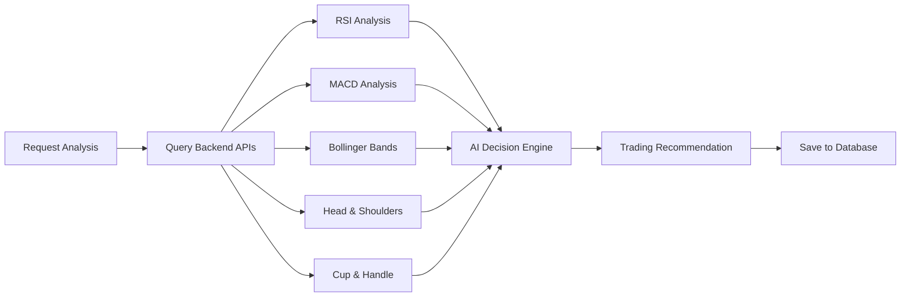

# StockTrack Portfolio API

**AI-Powered Portfolio Management & Trading System**

A comprehensive portfolio management API that acts as a **pretend bank account** with AI-driven trading decisions. The system integrates with the StockTrack backend API to analyze stocks using multiple technical indicators and make intelligent trading recommendations.

## 🎯 Key Features

- **🤖 AI Trading Assistant** - Analyzes stocks using RSI, MACD, Bollinger Bands, Head & Shoulders, and Cup & Handle patterns
- **💰 Virtual Bank Account** - Manages portfolio with $100,000 starting cash
- **📊 SQLite Database** - Persistent storage for portfolios, holdings, and trading decisions
- **🔍 Multi-Indicator Analysis** - Combines multiple technical indicators for trading signals
- **📈 Real-time Integration** - Live market data from Alpha Vantage API
- **🎯 Smart Recommendations** - BUY/SELL/HOLD/WATCH signals with confidence levels

## 🚀 Quick Start

### Prerequisites
- **Backend API** running on port 3000 (StockTrack technical indicators)
- **Alpha Vantage API Key** configured in backend
- Node.js 18+ and npm

### Setup & Installation

```bash
# Install dependencies
npm install

# Build TypeScript
npm run build

# Start the server
npm start
```

The server will:
- 🚀 Start on **port 3001**
- 📊 Create SQLite database at `data/portfolio.db`
- 👤 Initialize your user account (Blair Lane)
- 💰 Create empty portfolio with $100,000 cash
- 🔗 Connect to backend API on port 3000

### Your Default Account
- **User**: Blair Lane (user-blair-1)
- **Portfolio**: "Blair's Trading Account" (portfolio-blair-main)
- **Starting Cash**: $100,000
- **Holdings**: Empty (clean slate as requested)

## 🤖 AI Trading System

The portfolio API acts as your **intelligent trading assistant** that:

1. **Analyzes Stocks** using multiple technical indicators from the backend API
2. **Makes Trading Decisions** based on combined signals (BUY/SELL/HOLD/WATCH)
3. **Calculates Position Sizes** based on confidence and risk management
4. **Saves All Decisions** to database with detailed reasoning
5. **Provides Risk/Reward Analysis** for each recommendation

### How It Works



## 📊 API Endpoints

### 🎯 AI Trading Analysis
```bash
# Analyze individual stock (all indicators)
GET  /api/portfolio/analyze/stock/AAPL
POST /api/portfolio/analyze/stock/AAPL

# Analyze with specific strategy
GET  /api/portfolio/analyze/AAPL/strategy/strategy-bollinger-only
POST /api/portfolio/analyze/AAPL/strategy/strategy-rsi-ema

# Analyze multiple stocks
POST /api/portfolio/analyze/multiple
Body: {"symbols": ["AAPL", "MSFT", "GOOGL"]}

# Analyze popular stocks (15 stocks)
GET  /api/portfolio/analyze/popular
POST /api/portfolio/analyze/popular

# Get trading decisions history
GET /api/portfolio/:id/trading-decisions
```

### 🎯 Custom Trading Strategies
```bash
# Get all available strategies
GET /api/portfolio/:id/strategies

# Create custom strategy
POST /api/portfolio/:id/strategies
Body: {
  "name": "RSI Only Strategy",
  "description": "Simple RSI-based strategy",
  "indicators": ["rsi"],
  "buyConditions": {"rsi_below": 25},
  "sellConditions": {"rsi_above": 75},
  "riskManagement": {"stop_loss_percent": 4, "take_profit_percent": 8}
}

# Update strategy
PUT /api/portfolio/strategies/:strategyId

# Delete strategy
DELETE /api/portfolio/strategies/:strategyId

# Assign strategy to watchlist stock
PUT /api/portfolio/:id/watchlist/:symbol/strategy
Body: {"strategyId": "strategy-bollinger-only"}

# Assign strategy to holding
PUT /api/portfolio/:id/holdings/:holdingId/strategy
Body: {"strategyId": "strategy-rsi-ema"}
```

### 🏦 Portfolio Management
```bash
GET    /api/portfolio           # Get all user portfolios
POST   /api/portfolio           # Create new portfolio
GET    /api/portfolio/:id       # Get specific portfolio
PUT    /api/portfolio/:id       # Update portfolio
DELETE /api/portfolio/:id       # Delete portfolio
```

### Portfolio Management
```
GET    /api/portfolio           # Get all user portfolios
POST   /api/portfolio           # Create new portfolio
GET    /api/portfolio/:id       # Get specific portfolio
PUT    /api/portfolio/:id       # Update portfolio
DELETE /api/portfolio/:id       # Delete portfolio
```

### 📈 Holdings Management
```bash
GET    /api/portfolio/:id/holdings              # Get portfolio holdings
POST   /api/portfolio/:id/holdings              # Add new holding
PUT    /api/portfolio/:id/holdings/:holdingId   # Update holding
DELETE /api/portfolio/:id/holdings/:holdingId   # Remove holding
```

### 📊 Portfolio Analysis
```bash
GET /api/portfolio/:id/analysis     # Portfolio analysis & metrics
GET /api/portfolio/:id/performance  # Performance tracking
GET /api/portfolio/:id/risk         # Risk analysis
```

### 👀 Watchlist Management
```bash
GET    /api/portfolio/:id/watchlist         # Get watchlist
POST   /api/portfolio/:id/watchlist         # Add to watchlist
DELETE /api/portfolio/:id/watchlist/:symbol # Remove from watchlist
```

### 🔍 Health & Status
```bash
GET /health              # Basic health check
GET /health/detailed     # Detailed health check with backend connectivity
```

### 🎮 Interactive Documentation
```bash
GET /docs/api-docs.html  # Beautiful interactive API documentation
```

## 🧠 AI Trading Decision Engine

### Decision Making Process

The AI analyzes **5 technical indicators** and combines their signals:

1. **RSI (Relative Strength Index)**
   - Oversold (< 30) = Buy signal
   - Overbought (> 70) = Sell signal

2. **MACD (Moving Average Convergence Divergence)**
   - Bullish crossover = Buy signal
   - Bearish crossover = Sell signal

3. **Bollinger Bands**
   - Price near lower band = Buy signal
   - Price near upper band = Sell signal

4. **Head & Shoulders Pattern**
   - Pattern detected = Strong sell signal
   - Includes target price and stop loss

5. **Cup & Handle Pattern**
   - Pattern detected = Strong buy signal
   - Includes target price and stop loss

### Signal Strength & Confidence

- **HIGH Confidence**: 3+ indicators agree
- **MEDIUM Confidence**: 2 indicators agree
- **LOW Confidence**: Mixed or weak signals

### Position Sizing

- **HIGH Confidence**: 10% of portfolio
- **MEDIUM Confidence**: 7% of portfolio
- **LOW Confidence**: 5% of portfolio

## 🔧 Backend Integration

Integrates with **StockTrack Backend API** (port 3000) for:

- **Real-time Market Data** via Alpha Vantage API
- **Technical Indicators**: RSI, MACD, Bollinger Bands, Head & Shoulders, Cup & Handle
- **Pattern Recognition** with confidence scoring
- **Risk/Reward Calculations** for each trade recommendation

## 📈 Features

### ✅ Implemented Features

- **🤖 AI Trading Assistant** - Multi-indicator analysis with BUY/SELL/HOLD/WATCH recommendations
- **💾 SQLite Database** - Persistent storage for all portfolio data and trading decisions
- **📊 Portfolio Management** - Create, update, delete portfolios with $100,000 starting cash
- **📈 Holdings Tracking** - Add, update, remove stock holdings with real-time valuations
- **👀 Watchlist Management** - Track stocks with AI-powered trading signals
- **🔍 Trading Decisions History** - Complete audit trail of all AI recommendations
- **📊 Multi-Indicator Analysis** - RSI, MACD, Bollinger Bands, Head & Shoulders, Cup & Handle
- **🎯 Position Sizing** - Intelligent position sizing based on confidence and risk
- **📈 Real-time Integration** - Live market data from Alpha Vantage via backend API
- **🎮 Interactive Documentation** - Beautiful web interface for testing all endpoints
- **🔒 Health Monitoring** - Comprehensive health checks with backend connectivity

### 🔄 Future Enhancements

- **⚡ Real-time Updates** - WebSocket support for live portfolio updates
- **📊 Advanced Analytics** - Sector allocation, correlation analysis, Sharpe ratio
- **🔙 Backtesting** - Historical performance simulation of AI trading strategies
- **🚨 Alerts & Notifications** - Price alerts and portfolio notifications
- **📱 Mobile API** - Optimized endpoints for mobile apps
- **🤖 Machine Learning** - Enhanced AI models with historical performance learning

## 🏗️ Architecture

### Project Structure
```
src/
├── controllers/         # Request handlers & API endpoints
├── services/           # Business logic & AI trading engine
│   ├── databasePortfolioService.ts    # Database operations
│   ├── tradingService.ts              # AI trading decisions
│   └── backendService.ts              # Backend API integration
├── database/           # Database schema & connection
│   ├── connection.ts   # SQLite connection & utilities
│   └── schema.sql      # Database schema definition
├── routes/             # API route definitions
├── types/              # TypeScript type definitions
├── middleware/         # Custom middleware
└── utils/              # Utility functions
```

### Database Schema
```sql
📊 8 Tables:
├── users              # User accounts
├── portfolios         # Portfolio information
├── holdings           # Stock holdings
├── watchlist          # Watchlist items
├── transactions       # Buy/sell transactions
├── trading_decisions  # AI trading recommendations
├── market_data_cache  # Cached market data
└── portfolio_snapshots # Performance history
```

### AI Trading Flow
1. **Analysis Request** → Trading Service
2. **Multi-API Calls** → Backend API (RSI, MACD, Bollinger, H&S, C&H)
3. **AI Decision Engine** → Combines signals & calculates confidence
4. **Position Sizing** → Risk-based quantity calculation
5. **Database Storage** → Save decision with full reasoning
6. **Response** → Trading recommendation with detailed analysis

## 🔒 Security & Performance

- **🔐 CORS Protection** - Cross-origin request security
- **🛡️ Helmet Security** - HTTP security headers
- **⚡ Rate Limiting** - API request throttling
- **✅ Input Validation** - Request data validation
- **💾 Database Transactions** - ACID compliance for data integrity
- **🔄 Connection Pooling** - Efficient database connections

## 🧪 Testing & Development

```bash
# Development with auto-reload
npm run dev

# Build TypeScript
npm run build

# Production server
npm start

# Run tests (when implemented)
npm test

# Linting
npm run lint
npm run lint:fix
```

## 🌐 Environment Variables

| Variable | Description | Default |
|----------|-------------|---------|
| `PORT` | Server port | `3001` |
| `NODE_ENV` | Environment | `development` |
| `BACKEND_API_URL` | Backend API URL | `http://localhost:3000` |
| `FRONTEND_URL` | Frontend URL for CORS | `http://localhost:3000` |

**Note**: The system uses SQLite database stored in `data/portfolio.db` - no additional database configuration required!

## 📚 API Examples

### 🤖 AI Trading Analysis

```bash
# Analyze Apple stock (all indicators)
curl http://localhost:3001/api/portfolio/analyze/stock/AAPL

# Analyze AAPL with Bollinger Bands only
curl http://localhost:3001/api/portfolio/analyze/AAPL/strategy/strategy-bollinger-only

# Analyze TSLA with RSI + EMA strategy
curl http://localhost:3001/api/portfolio/analyze/TSLA/strategy/strategy-rsi-ema

# Analyze popular stocks (15 stocks)
curl http://localhost:3001/api/portfolio/analyze/popular

# Get your trading decisions history
curl http://localhost:3001/api/portfolio/portfolio-blair-main/trading-decisions \
  -H "user-id: user-blair-1"

# Analyze stock with live data
curl  http://localhost:3000/api/rsi/MSFT/quick?mock=false
```

### 🎯 Custom Trading Strategies

```bash
# Get all available strategies
curl http://localhost:3001/api/portfolio/portfolio-blair-main/strategies \
  -H "user-id: user-blair-1"

# Create a custom RSI-only strategy
curl -X POST http://localhost:3001/api/portfolio/portfolio-blair-main/strategies \
  -H "Content-Type: application/json" \
  -H "user-id: user-blair-1" \
  -d '{
    "name": "RSI Scalping",
    "description": "Quick RSI-based trades",
    "indicators": ["rsi"],
    "buyConditions": {"rsi_below": 20},
    "sellConditions": {"rsi_above": 80},
    "riskManagement": {"stop_loss_percent": 3, "take_profit_percent": 6}
  }'

# Assign Bollinger Bands strategy to AAPL in watchlist
curl -X PUT http://localhost:3001/api/portfolio/portfolio-blair-main/watchlist/AAPL/strategy \
  -H "Content-Type: application/json" \
  -H "user-id: user-blair-1" \
  -d '{"strategyId": "strategy-bollinger-only"}'
```

### 🏦 Portfolio Management

```bash
# Get your portfolio
curl http://localhost:3001/api/portfolio \
  -H "user-id: user-blair-1"

# Add a stock holding
curl -X POST http://localhost:3001/api/portfolio/portfolio-blair-main/holdings \
  -H "Content-Type: application/json" \
  -H "user-id: user-blair-1" \
  -d '{
    "symbol": "AAPL",
    "quantity": 100,
    "averagePrice": 150.00,
    "purchaseDate": "2024-01-15T00:00:00.000Z"
  }'

# Add to watchlist
curl -X POST http://localhost:3001/api/portfolio/portfolio-blair-main/watchlist \
  -H "Content-Type: application/json" \
  -H "user-id: user-blair-1" \
  -d '{
    "symbol": "TSLA",
    "notes": "Waiting for AI buy signal",
    "addedDate": "2024-01-15T00:00:00.000Z"
  }'
```

### 🎮 Interactive Testing

Visit the beautiful interactive documentation:
```
http://localhost:3001/docs/api-docs.html
```

## 🚀 Strategy-Based Analysis Workflow

### Step 1: Choose Your Strategy
```bash
# See all available strategies
curl http://localhost:3001/api/portfolio/portfolio-blair-main/strategies \
  -H "user-id: user-blair-1"
```

### Step 2: Add Stock to Watchlist
```bash
# Add AAPL to watchlist
curl -X POST http://localhost:3001/api/portfolio/portfolio-blair-main/watchlist \
  -H "Content-Type: application/json" \
  -H "user-id: user-blair-1" \
  -d '{
    "symbol": "AAPL",
    "notes": "Testing Bollinger Bands strategy"
  }'
```

### Step 3: Assign Strategy to Stock
```bash
# Assign Bollinger Bands strategy to AAPL
curl -X PUT http://localhost:3001/api/portfolio/portfolio-blair-main/watchlist/AAPL/strategy \
  -H "Content-Type: application/json" \
  -H "user-id: user-blair-1" \
  -d '{"strategyId": "strategy-bollinger-only"}'
```

### Step 4: Analyze with Your Strategy
```bash
# Analyze AAPL using only Bollinger Bands
curl http://localhost:3001/api/portfolio/analyze/AAPL/strategy/strategy-bollinger-only
```

### Step 5: Example Strategy Response
```json
{
  "success": true,
  "data": {
    "symbol": "AAPL",
    "currentPrice": 150.25,
    "recommendation": "BUY",
    "confidence": "MEDIUM",
    "reasoning": [
      "🎯 Using strategy: \"Bollinger Bands Only\"",
      "� Indicators: bollinger-bands",
      "🟢 Bollinger Bands buy signal - price near lower band"
    ],
    "targetPrice": 165.00,
    "stopLoss": 142.75,
    "recommendedQuantity": 66,
    "riskReward": 1.8
  }
}
```

## 🎯 Strategy Comparison Examples

```bash
# Compare different strategies on the same stock

# AAPL with Bollinger Bands (mean reversion)
curl http://localhost:3001/api/portfolio/analyze/AAPL/strategy/strategy-bollinger-only

# AAPL with RSI + EMA (trend following)
curl http://localhost:3001/api/portfolio/analyze/AAPL/strategy/strategy-rsi-ema

# AAPL with all indicators (comprehensive)
curl http://localhost:3001/api/portfolio/analyze/AAPL/strategy/strategy-all-indicators
```

## 📋 Quick Strategy Reference

| Strategy Name | Strategy ID | Indicators | Best For |
|---------------|-------------|------------|----------|
| **Bollinger Bands Only** | `strategy-bollinger-only` | `bollinger-bands` | Mean reversion, range-bound stocks |
| **RSI + EMA Combo** | `strategy-rsi-ema` | `rsi`, `ema` | Trend following, momentum |
| **MACD + RSI Power** | `strategy-macd-rsi` | `macd`, `rsi` | Growth stocks, momentum confirmation |
| **Chart Patterns Only** | `strategy-pattern-focus` | `head-and-shoulders`, `cup-handle` | Pattern recognition, technical analysis |
| **Full Analysis** | `strategy-all-indicators` | All 5 indicators | Conservative trading, high confidence |

### 🚀 Quick Start Commands

```bash
# Analyze any stock with any strategy
curl http://localhost:3001/api/portfolio/analyze/{SYMBOL}/strategy/{STRATEGY_ID}

# Examples:
curl http://localhost:3001/api/portfolio/analyze/AAPL/strategy/strategy-bollinger-only
curl http://localhost:3001/api/portfolio/analyze/TSLA/strategy/strategy-rsi-ema
curl http://localhost:3001/api/portfolio/analyze/NVDA/strategy/strategy-pattern-focus
```

## 🎯 Pre-Built Trading Strategies

Your portfolio comes with 5 ready-to-use trading strategies:

### 1. **🔵 Bollinger Bands Only** (`strategy-bollinger-only`)
```bash
# Use for mean reversion trading
curl http://localhost:3001/api/portfolio/analyze/AAPL/strategy/strategy-bollinger-only
```
- **Indicators**: Bollinger Bands only
- **Buy**: Price near lower band
- **Sell**: Price near upper band
- **Best for**: Range-bound stocks, mean reversion

### 2. **🟡 RSI + EMA Combo** (`strategy-rsi-ema`)
```bash
# Use for trend following with momentum
curl http://localhost:3001/api/portfolio/analyze/TSLA/strategy/strategy-rsi-ema
```
- **Indicators**: RSI + EMA
- **Buy**: RSI < 30 + bullish EMA trend
- **Sell**: RSI > 70 + bearish EMA trend
- **Best for**: Trending stocks, momentum plays

### 3. **🟢 MACD + RSI Power** (`strategy-macd-rsi`)
```bash
# Use for momentum confirmation
curl http://localhost:3001/api/portfolio/analyze/NVDA/strategy/strategy-macd-rsi
```
- **Indicators**: MACD + RSI
- **Buy**: MACD bullish + RSI < 50
- **Sell**: MACD bearish + RSI > 50
- **Best for**: Growth stocks, momentum confirmation

### 4. **🔴 Chart Patterns Only** (`strategy-pattern-focus`)
```bash
# Use for pattern-based trading
curl http://localhost:3001/api/portfolio/analyze/GOOGL/strategy/strategy-pattern-focus
```
- **Indicators**: Head & Shoulders + Cup & Handle
- **Buy**: Cup & Handle pattern (HIGH confidence)
- **Sell**: Head & Shoulders pattern (HIGH confidence)
- **Best for**: Technical analysis, pattern recognition

### 5. **⚫ Full Analysis** (`strategy-all-indicators`)
```bash
# Use for comprehensive analysis
curl http://localhost:3001/api/portfolio/analyze/MSFT/strategy/strategy-all-indicators
```
- **Indicators**: All 5 indicators
- **Buy**: 3+ bullish signals
- **Sell**: 3+ bearish signals
- **Best for**: Conservative trading, high confidence signals

## 📈 Popular Stocks Analyzed

The system analyzes these 15 popular stocks by default:
- **AAPL** (Apple) - Technology
- **MSFT** (Microsoft) - Technology
- **GOOGL** (Alphabet) - Technology
- **AMZN** (Amazon) - E-commerce
- **TSLA** (Tesla) - Electric Vehicles
- **NVDA** (NVIDIA) - Semiconductors
- **META** (Meta) - Social Media
- **NFLX** (Netflix) - Streaming
- **AMD** (AMD) - Semiconductors
- **CRM** (Salesforce) - Cloud Software
- **UBER** (Uber) - Transportation
- **SPOT** (Spotify) - Music Streaming
- **ZOOM** (Zoom) - Video Communications
- **SQ** (Block) - Fintech
- **PYPL** (PayPal) - Payments

## 🤝 Contributing

1. Fork the repository
2. Create a feature branch (`git checkout -b feature/amazing-feature`)
3. Implement your changes with proper TypeScript types
4. Add tests for new functionality
5. Update documentation
6. Submit a pull request

## 📄 License

This project is licensed under the ISC License.

---

**🎯 Ready to start AI-powered trading? Your portfolio is waiting with $100,000 to invest!**

Visit: `http://localhost:3001/docs/api-docs.html` to get started!
